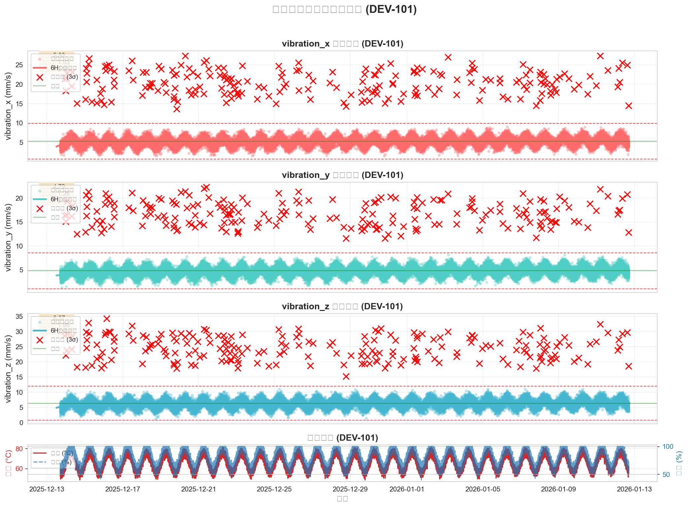

# ⚡ 电力设备分析系统 (Test-Power_Equipent_Analysis)

这是一个基于 Python 和 Jupyter Notebook 的电力设备数据分析实战项目。
测试修改

## 🚀 功能特点
* **数据清洗**：自动处理电力设备的原始传感器数据。
* **可视化分析**：生成设备运行趋势图和振动分布图。
* **异常检测**：通过算法识别潜在的故障隐患。

## 🛠️ 安装环境
1. 克隆项目：
   `git clone https://github.com/你的用户名/仓库名.git`
2. 安装依赖：
   `pip install pandas matplotlib jupyter`

## 📊 示例截图

